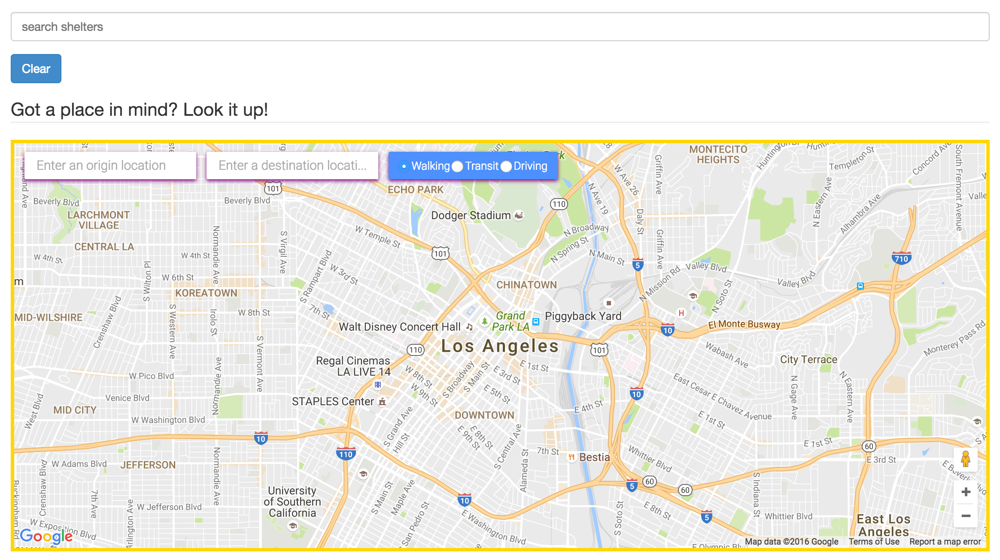

# Helping Hand App

<i>A Mapping service for the inner cities underprivileged.
This application will provide the homeless and economically 
troubled a resource of shelter locations and a community to 
communicate with online.</i>

# TEAM 

### Back End Ror Developer
<a href="alex1100.software">Alex Aleksanyan</a> 
 
### Front End Developer
<a href="www.singhgallery.com">Singh Gagandeep</a>
 
### Lead UX/UI Developer
<a href="#">Dimple Patel</a>

# Technologies Used

- Ruby on Rails
- Google Embedded Maps API
- Google Distance Matrix API
- Google Street View API
- Google Maps API
- Google Places API
